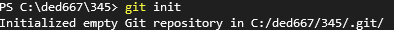
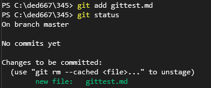
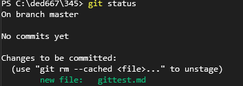
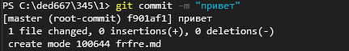
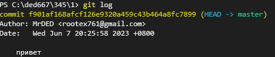

### Что такое Git?
Git - это одна из реализаций распределённых 
контроля версий, имеющая как и локальные, так и удалённые репозитория!
*********************************************************************
**                    Основные команды Git.                        **
*********************************************************************
# 1. Создания рипозитория
Git init - создания локального репозитория 

# 2. Добавления изменений в коммит
Git add - добавляет изменение из рабочего каталога в раздел проиндексированных файлов
пример: git add (имя файла) 

# 3. Просмотр состояния репозитория 
git status - команда нужна для просмотра состояния репозитория 

# 4. Создания коммитоа
git commit - это команда для записи индексированных
изменений в репозиторий Git

# 5. Вывод на экран истории всех коммитов с их хэш-кодами
git log - отображает отправленные снимки состояния и
позволяет просматривать историю проекта

